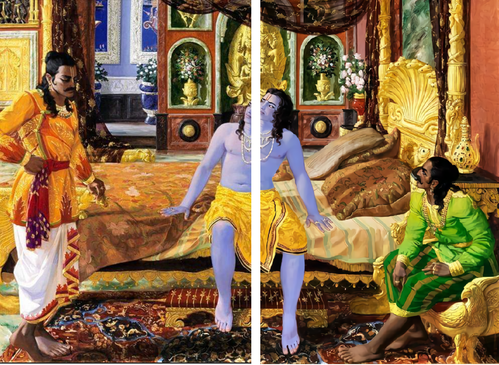
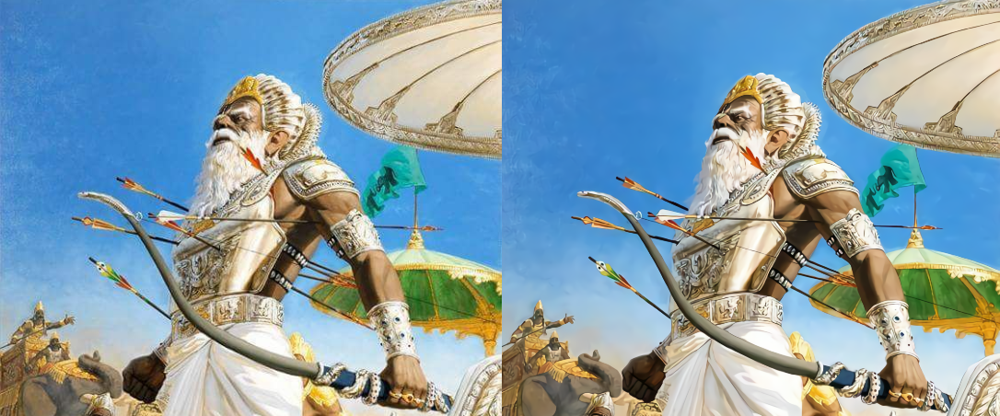
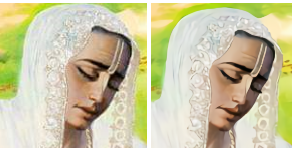
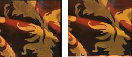
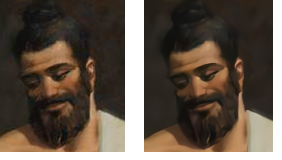

# Upscaling Giampaolo Tomasetti's Mahabaratha paintings.
Giampaolo Tomasetti’s is a co-founder and a member of the International Academy of Vedic Art. He studied Mahabaratha for 5 years and took 12 years to complete his collection of 25 majestic paintings depicting the main moments of the Mahabharata.
If you are interested in Mahabaratha and Art, I highly recommend reading <a href='https://www.goodreads.com/book/show/28574720-mahabharata>Mahabarata by Giampaolo Tomasetti </a>. The book details the backstory for each of the paintings and how it came about.

This is an attempt to upscale these images using <a href='https://arxiv.org/pdf/1501.00092.pdf'>SRCNN</a> and <a href='https://github.com/nagadomi/waifu2x'>Waifu 2x</a> in particular.
This is the support repository for the medium blog post found <a href='https://medium.com/@adiamaankeerthi/unleashing-a-neural-network-trained-in-anime-art-onto-mahabaratha-paintings-3236f56beed4'>here</a>. 
The compressed pixelated paintings are obtained from <a href='https://atmanirvana.com/mahabharata-in-painting/'>here</a>. 

## Results

<i>Left is the original compressed image and Right is the upscaled image.</i>

### Effects on faces

### Effects on fabric:

### Effects on Hair:

